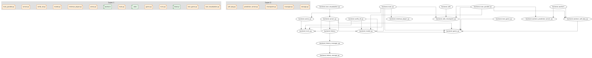

# backend 架构文档

> **版本**: 1.0.0  
> **更新日期**: 2025-12-07  
> **模块类型**: python

---

## 1. 概述

<!-- HUMAN:overview -->
backend 模块负责 [TODO: 描述模块的核心职责和业务价值]。

**设计背景**：[TODO: 为什么需要这个模块？它解决了什么问题？]

**核心能力**：
- [TODO: 能力 1]
- [TODO: 能力 2]
<!-- /HUMAN:overview -->

---

## 2. 模块结构

<!-- AUTO:structure -->
```
backend/
├── test_visualization.py
├── test_game.py
├── history/
│   ├── storage.py
│   └── manager.py
├── rl/
│   ├── config.py
│   ├── training/
│   │   ├── logger.py
│   │   ├── dataset.py
│   │   └── broadcast.py
│   ├── utils/
│   │   └── checkpoint.py
│   ├── workers/
│   │   ├── prediction_server.py
│   │   └── self_play.py
│   ├── evaluation/
│   │   ├── metrics.py
│   │   ├── arena.py
│   │   └── players.py
│   ├── algorithms/
│   │   └── mcts.py
│   └── models/
│       ├── res_block.py
│       └── xiangqi_net.py
├── checkpoints/
├── game.py
├── utils/
├── train.py
├── workers/
│   ├── prediction_server.py
│   └── self_play.py
├── data/
│   ├── history/
│   └── evolution/
├── verify_all.py
├── server.py
└── train_parallel.py
```
<!-- /AUTO:structure -->

---

## 3. 层级职责

<!-- AUTO:responsibilities -->
| 文件 | 层级 | 职责 |
|------|------|------|
| `test_visualization.py` | [TODO] | [TODO: 描述职责] |
| `test_game.py` | [TODO] | [TODO: 描述职责] |
| `history/` | [TODO] | [TODO: 描述职责] |
| `storage.py` | [TODO] | [TODO: 描述职责] |
| `manager.py` | [TODO] | [TODO: 描述职责] |
| `rl/` | [TODO] | [TODO: 描述职责] |
| `config.py` | [TODO] | [TODO: 描述职责] |
| `training/` | [TODO] | [TODO: 描述职责] |
| `logger.py` | [TODO] | [TODO: 描述职责] |
| `dataset.py` | [TODO] | [TODO: 描述职责] |
| `broadcast.py` | [TODO] | [TODO: 描述职责] |
| `utils/` | [TODO] | [TODO: 描述职责] |
| `checkpoint.py` | [TODO] | [TODO: 描述职责] |
| `workers/` | [TODO] | [TODO: 描述职责] |
| `prediction_server.py` | [TODO] | [TODO: 描述职责] |
| `self_play.py` | [TODO] | [TODO: 描述职责] |
| `evaluation/` | [TODO] | [TODO: 描述职责] |
| `metrics.py` | [TODO] | [TODO: 描述职责] |
| `arena.py` | [TODO] | [TODO: 描述职责] |
| `players.py` | [TODO] | [TODO: 描述职责] |
| `algorithms/` | [TODO] | [TODO: 描述职责] |
| `mcts.py` | [TODO] | [TODO: 描述职责] |
| `models/` | [TODO] | [TODO: 描述职责] |
| `res_block.py` | [TODO] | [TODO: 描述职责] |
| `xiangqi_net.py` | [TODO] | [TODO: 描述职责] |
| `game.py` | [TODO] | [TODO: 描述职责] |
| `utils/` | [TODO] | [TODO: 描述职责] |
| `train.py` | [TODO] | [TODO: 描述职责] |
| `workers/` | [TODO] | [TODO: 描述职责] |
| `prediction_server.py` | [TODO] | [TODO: 描述职责] |
| `self_play.py` | [TODO] | [TODO: 描述职责] |
| `verify_all.py` | [TODO] | [TODO: 描述职责] |
| `server.py` | [TODO] | [TODO: 描述职责] |
| `train_parallel.py` | [TODO] | [TODO: 描述职责] |
<!-- /AUTO:responsibilities -->

<!-- HUMAN:responsibilities_notes -->
**职责说明**：

[TODO: 补充各文件的详细职责描述，说明每个文件在整体架构中的角色]
<!-- /HUMAN:responsibilities_notes -->

---

## 4. 依赖关系

<!-- AUTO:dependencies -->
**架构图**：



> 生成命令: `python3 -m scripts.module_inspector <module> --graph --files`

**依赖模块说明**：

| 依赖模块 | 依赖类型 | 业务逻辑 |
|----------|----------|----------|
| (无内部依赖) | - | - |
<!-- /AUTO:dependencies -->

<!-- HUMAN:dependency_notes -->
**依赖设计原则**：[TODO: 描述依赖的设计原则，如 "入口层 → 业务层 → 工具层"]

**补充说明**：

[TODO: 补充自动生成内容未能涵盖的依赖说明，如设计决策、历史原因等]
<!-- /HUMAN:dependency_notes -->
