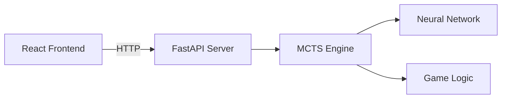

# AI4Edu-XiangQi 架构文档

> **版本**: 1.0.0  
> **更新日期**: 2025-12-07  
> **模块类型**: python

---

## 1. 概述

<!-- HUMAN:overview -->
AI4Edu-XiangQi 是一个基于 AlphaZero 算法的中国象棋（Xiangqi）AI 训练与对弈平台。

**设计背景**：为了研究和学习强化学习在棋类游戏中的应用，本项目实现了完整的 AlphaZero 训练流程，并提供了可视化的 Web 界面供用户与 AI 对弈。

**核心能力**：
- 🎮 **Web 对弈界面**：React + TypeScript 构建的现代化象棋 UI
- 🤖 **AlphaZero AI**：基于 PyTorch 的 ResNet + MCTS 实现
- 🔄 **自我对弈训练**：完整的训练流水线，支持 GPU 加速
- 🔌 **前后端分离**：FastAPI 后端服务，支持独立部署
<!-- /HUMAN:overview -->

---

## 2. 模块结构

<!-- AUTO:structure -->
```
AI4Edu-XiangQi/
├── vite.config.ts
├── constants.ts
├── backend/
│   ├── test_game.py
│   ├── mcts.py
│   ├── game.py
│   ├── train.py
│   ├── model.py
│   ├── verify_all.py
│   └── server.py
├── index.tsx
├── utils/
│   ├── gameLogic.ts
│   └── aiLogic.ts
├── types.ts
├── components/
│   ├── XiangqiPiece.tsx
│   └── XiangqiBoard.tsx
├── App.tsx
└── module_inspector/
    ├── guide.py
    ├── parsers/
    │   ├── python_parser.py
    │   ├── js_parser.py
    │   └── stdlib_modules.py
    ├── resolver.py
    ├── common/
    │   ├── config.py
    │   └── colors.py
    ├── cli/
    ├── visualizer/
    │   ├── mermaid.py
    │   ├── graph.py
    │   └── mermaid_printer.py
    ├── mcp_server.py
    ├── cli.py
    ├── output.py
    ├── doc_tools/
    │   ├── cli/
    │   │   └── output.py
    │   ├── templates/
    │   │   └── parts/
    │   └── core/
    │       ├── checker.py
    │       ├── updater.py
    │       ├── section_parser.py
    │       ├── context.py
    │       ├── content_generators.py
    │       ├── template.py
    │       ├── generator.py
    │       └── models.py
    ├── __main__.py
    └── core/
        ├── layer_validator.py
        ├── analyzer_utils.py
        ├── analyzer.py
        ├── scanner.py
        └── models.py
```
<!-- /AUTO:structure -->

---

## 3. 层级职责

<!-- AUTO:responsibilities -->
| 文件 | 层级 | 职责 |
|------|------|------|
| `App.tsx` | 前端/入口 | 主应用组件，管理游戏状态和用户交互 |
| `index.tsx` | 前端/入口 | React应用入口点 |
| `types.ts` | 前端/类型 | TypeScript类型定义 |
| `constants.ts` | 前端/配置 | 棋盘初始布局和常量定义 |
| `XiangqiBoard.tsx` | 前端/组件 | 棋盘渲染组件 |
| `XiangqiPiece.tsx` | 前端/组件 | 棋子渲染组件 |
| `gameLogic.ts` | 前端/逻辑 | 前端游戏规则和走法验证 |
| `aiLogic.ts` | 前端/逻辑 | 本地备用AI（简单算法） |
| `game.py` | 后端/核心 | 象棋规则引擎，棋盘状态管理 |
| `model.py` | 后端/AI | ResNet神经网络架构 |
| `mcts.py` | 后端/AI | 蒙特卡洛树搜索实现 |
| `train.py` | 后端/训练 | 自我对弈训练循环 |
| `server.py` | 后端/服务 | FastAPI HTTP接口 |
| `vite.config.ts` | 构建 | Vite构建配置 |
<!-- /AUTO:responsibilities -->

<!-- HUMAN:responsibilities_notes -->
**职责说明**：

项目采用分层架构设计：
- **前端层**：React组件处理UI渲染和用户交互
- **后端层**：Python实现AI核心逻辑
- **通信层**：FastAPI提供RESTful API接口
<!-- /HUMAN:responsibilities_notes -->

---

## 4. 依赖关系

<!-- AUTO:dependencies -->
**架构图**：


> 生成命令: `python3 -m scripts.module_inspector <module> --graph --files`

**依赖模块说明**：

| 依赖模块 | 依赖类型 | 业务逻辑 |
|----------|----------|----------|
| (无内部依赖) | - | - |
<!-- /AUTO:dependencies -->

<!-- HUMAN:dependency_notes -->
**依赖设计原则**：前端 → FastAPI → AlphaZero核心

**补充说明**：



- 前端通过HTTP调用后端API获取AI走子
- 后端服务封装了完整的AlphaZero推理流程
- 如果后端不可用，前端会回退到本地简单AI
<!-- /HUMAN:dependency_notes -->
