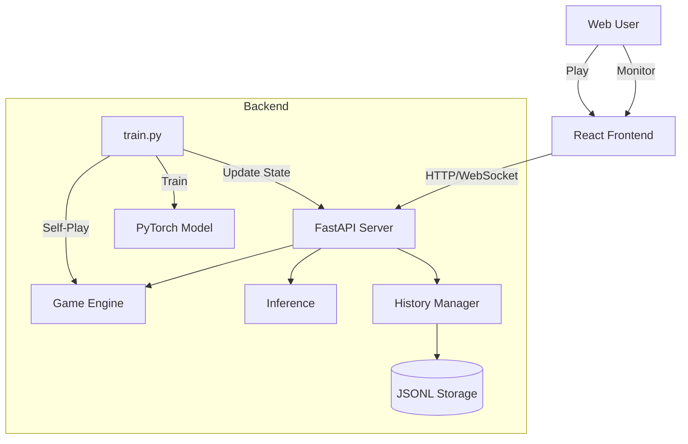

# AI4Edu-XiangQi 架构文档

> **版本**: 1.0.0  
> **更新日期**: 2025-12-07  
> **模块类型**: python

---

## 1. 概述

<!-- HUMAN:overview -->
AI4Edu-XiangQi 是一个基于 AlphaZero 算法的中国象棋（Xiangqi）AI 训练与对弈平台。

**设计背景**：为了研究和学习强化学习在棋类游戏中的应用，本项目实现了完整的 AlphaZero 训练流程，并提供了可视化的 Web 界面供用户与 AI 对弈。

**核心能力**：
- 🎮 **Web 对弈界面**：React + TypeScript 构建的现代化象棋 UI
- 🤖 **AlphaZero AI**：基于 PyTorch 的 ResNet + MCTS 实现
- 🔄 **自我对弈训练**：完整的训练流水线，支持 GPU 加速
- 🔌 **前后端分离**：FastAPI 后端服务，支持独立部署
<!-- /HUMAN:overview -->

---

## 2. 模块结构

<!-- AUTO:structure -->
```
AI4Edu-XiangQi/
├── vite.config.ts
├── backend/
│   ├── classic/
│   │   ├── evaluation.py
│   │   └── minimax.py
│   ├── rl/
│   │   ├── algorithms/
│   │   │   └── mcts.py
│   │   ├── evaluation/
│   │   │   ├── arena.py
│   │   │   ├── metrics.py
│   │   │   └── players.py
│   │   ├── models/
│   │   │   ├── res_block.py
│   │   │   └── xiangqi_net.py
│   │   ├── training/
│   │   │   ├── broadcast.py
│   │   │   ├── coach.py
│   │   │   ├── dataset.py
│   │   │   ├── logger.py
│   │   │   └── parallel_trainer.py
│   │   ├── utils/
│   │   │   └── checkpoint.py
│   │   ├── workers/
│   │   │   ├── prediction_server.py
│   │   │   └── self_play.py
│   │   ├── config.py
│   │   └── train.py
│   ├── tests/
│   │   ├── test_game.py
│   │   ├── test_verification.py
│   │   └── test_visualization.py
│   ├── data/
│   ├── history/
│   ├── checkpoints/
│   ├── game.py
│   └── server.py
├── src/
│   ├── store/
│   │   ├── index.ts
│   │   ├── GameContext.tsx
│   │   └── ReplayContext.tsx
│   ├── api/
│   │   ├── trainingApi.ts
│   │   ├── client.ts
│   │   ├── gameApi.ts
│   │   └── index.ts
│   ├── constants.ts
│   ├── utils/
│   │   └── index.ts
│   ├── types.ts
│   ├── components/
│   │   ├── game/
│   │   │   ├── XiangqiPiece.tsx
│   │   │   └── XiangqiBoard.tsx
│   │   ├── common/
│   │   │   ├── Button.tsx
│   │   │   └── Card.tsx
│   │   ├── replay/
│   │   │   ├── PlaybackDock.tsx
│   │   │   ├── ReplayLayout.tsx
│   │   │   └── GameHistoryCard.tsx
│   │   ├── layout/
│   │   │   ├── MainLayout.tsx
│   │   │   ├── GameControlPanel.tsx
│   │   │   └── Navbar.tsx
│   │   └── training/
│   │       ├── TrainingPage.tsx
│   │       └── TrainingDashboard.tsx
│   └── pages/
│       └── ReplayPage.tsx
├── index.tsx
├── utils/
│   ├── gameLogic.ts
│   └── aiLogic.ts
├── components/
├── App.tsx
└── module_inspector/
    ├── guide.py
    ├── parsers/
    │   ├── python_parser.py
    │   ├── js_parser.py
    │   └── stdlib_modules.py
    ├── resolver.py
    ├── common/
    │   ├── config.py
    │   └── colors.py
    ├── cli/
    ├── visualizer/
    │   ├── mermaid.py
    │   ├── graph.py
    │   └── mermaid_printer.py
    ├── mcp_server.py
    ├── cli.py
    ├── output.py
    ├── doc_tools/
    │   ├── cli/
    │   │   └── output.py
    │   ├── templates/
    │   │   └── parts/
    │   └── core/
    │       ├── checker.py
    │       ├── updater.py
    │       ├── section_parser.py
    │       ├── context.py
    │       ├── content_generators.py
    │       ├── template.py
    │       ├── generator.py
    │       └── models.py
    ├── __main__.py
    └── core/
        ├── layer_validator.py
        ├── analyzer_utils.py
        ├── analyzer.py
        ├── scanner.py
        └── models.py
```
<!-- /AUTO:structure -->

---

## 3. 层级职责

<!-- AUTO:responsibilities -->
| 文件 | 层级 | 职责 |
|------|------|------|
| `vite.config.ts` | [TODO] | [TODO: 描述职责] |
| `test_visualization.py` | [TODO] | [TODO: 描述职责] |
| `test_game.py` | [TODO] | [TODO: 描述职责] |
| `history/` | [TODO] | [TODO: 描述职责] |
| `storage.py` | [TODO] | [TODO: 描述职责] |
| `manager.py` | [TODO] | [TODO: 描述职责] |
| `mcts.py` | [TODO] | [TODO: 描述职责] |
| `game.py` | [TODO] | [TODO: 描述职责] |
| `utils/` | [TODO] | [TODO: 描述职责] |
| `checkpoint.py` | [TODO] | [TODO: 描述职责] |
| `train.py` | [TODO] | [TODO: 描述职责] |
| `workers/` | [TODO] | [TODO: 描述职责] |
| `prediction_server.py` | [TODO] | [TODO: 描述职责] |
| `self_play.py` | [TODO] | [TODO: 描述职责] |
| `arena.py` | [TODO] | [TODO: 描述职责] |
| `minimax_player.py` | [TODO] | [TODO: 描述职责] |
| `model.py` | [TODO] | [TODO: 描述职责] |
| `verify_all.py` | [TODO] | [TODO: 描述职责] |
| `server.py` | [TODO] | [TODO: 描述职责] |
| `train_parallel.py` | [TODO] | [TODO: 描述职责] |
| `index.ts` | [TODO] | [TODO: 描述职责] |
| `GameContext.tsx` | [TODO] | [TODO: 描述职责] |
| `ReplayContext.tsx` | [TODO] | [TODO: 描述职责] |
| `trainingApi.ts` | [TODO] | [TODO: 描述职责] |
| `client.ts` | [TODO] | [TODO: 描述职责] |
| `gameApi.ts` | [TODO] | [TODO: 描述职责] |
| `index.ts` | [TODO] | [TODO: 描述职责] |
| `constants.ts` | [TODO] | [TODO: 描述职责] |
| `index.ts` | [TODO] | [TODO: 描述职责] |
| `types.ts` | [TODO] | [TODO: 描述职责] |
| `XiangqiPiece.tsx` | [TODO] | [TODO: 描述职责] |
| `XiangqiBoard.tsx` | [TODO] | [TODO: 描述职责] |
| `Button.tsx` | [TODO] | [TODO: 描述职责] |
| `Card.tsx` | [TODO] | [TODO: 描述职责] |
| `PlaybackDock.tsx` | [TODO] | [TODO: 描述职责] |
| `ReplayLayout.tsx` | [TODO] | [TODO: 描述职责] |
| `GameHistoryCard.tsx` | [TODO] | [TODO: 描述职责] |
| `MainLayout.tsx` | [TODO] | [TODO: 描述职责] |
| `GameControlPanel.tsx` | [TODO] | [TODO: 描述职责] |
| `Navbar.tsx` | [TODO] | [TODO: 描述职责] |
| `TrainingPage.tsx` | [TODO] | [TODO: 描述职责] |
| `TrainingDashboard.tsx` | [TODO] | [TODO: 描述职责] |
| `ReplayPage.tsx` | [TODO] | [TODO: 描述职责] |
| `index.tsx` | [TODO] | [TODO: 描述职责] |
| `gameLogic.ts` | [TODO] | [TODO: 描述职责] |
| `aiLogic.ts` | [TODO] | [TODO: 描述职责] |
| `App.tsx` | [TODO] | [TODO: 描述职责] |
| `module_inspector/` | [TODO] | [TODO: 描述职责] |
| `guide.py` | [TODO] | [TODO: 描述职责] |
| `parsers/` | [TODO] | [TODO: 描述职责] |
| `python_parser.py` | [TODO] | [TODO: 描述职责] |
| `js_parser.py` | [TODO] | [TODO: 描述职责] |
| `stdlib_modules.py` | [TODO] | [TODO: 描述职责] |
| `resolver.py` | [TODO] | [TODO: 描述职责] |
| `common/` | [TODO] | [TODO: 描述职责] |
| `config.py` | [TODO] | [TODO: 描述职责] |
| `colors.py` | [TODO] | [TODO: 描述职责] |
| `visualizer/` | [TODO] | [TODO: 描述职责] |
| `mermaid.py` | [TODO] | [TODO: 描述职责] |
| `graph.py` | [TODO] | [TODO: 描述职责] |
| `mermaid_printer.py` | [TODO] | [TODO: 描述职责] |
| `mcp_server.py` | [TODO] | [TODO: 描述职责] |
| `cli.py` | [TODO] | [TODO: 描述职责] |
| `output.py` | [TODO] | [TODO: 描述职责] |
| `doc_tools/` | [TODO] | [TODO: 描述职责] |
| `cli/` | [TODO] | [TODO: 描述职责] |
| `output.py` | [TODO] | [TODO: 描述职责] |
| `core/` | [TODO] | [TODO: 描述职责] |
| `checker.py` | [TODO] | [TODO: 描述职责] |
| `updater.py` | [TODO] | [TODO: 描述职责] |
| `section_parser.py` | [TODO] | [TODO: 描述职责] |
| `context.py` | [TODO] | [TODO: 描述职责] |
| `content_generators.py` | [TODO] | [TODO: 描述职责] |
| `template.py` | [TODO] | [TODO: 描述职责] |
| `generator.py` | [TODO] | [TODO: 描述职责] |
| `models.py` | [TODO] | [TODO: 描述职责] |
| `__main__.py` | [TODO] | [TODO: 描述职责] |
| `core/` | [TODO] | [TODO: 描述职责] |
| `layer_validator.py` | [TODO] | [TODO: 描述职责] |
| `analyzer_utils.py` | [TODO] | [TODO: 描述职责] |
| `analyzer.py` | [TODO] | [TODO: 描述职责] |
| `scanner.py` | [TODO] | [TODO: 描述职责] |
| `models.py` | [TODO] | [TODO: 描述职责] |
<!-- /AUTO:responsibilities -->

<!-- HUMAN:responsibilities_notes -->
**职责说明**：

项目采用分层架构设计：
- **前端层**：React组件处理UI渲染和用户交互
- **后端层**：Python实现AI核心逻辑
- **通信层**：FastAPI提供RESTful API接口
<!-- /HUMAN:responsibilities_notes -->

---

## 4. 依赖关系

<!-- AUTO:dependencies -->
**架构图**：


> 生成命令: `python3 -m scripts.module_inspector <module> --graph --files`

**依赖模块说明**：

| 依赖模块 | 依赖类型 | 业务逻辑 |
|----------|----------|----------|
| (无内部依赖) | - | - |
<!-- /AUTO:dependencies -->

<!-- HUMAN:dependency_notes -->
**依赖设计原则**：前端 → FastAPI → AlphaZero核心

**数据流说明**：
1.  **对弈模式**：前端 -> HTTP POST -> Server -> AI Inference -> Response
2.  **训练模式**：
    *   `train.py` (后台进程) -> HTTP POST (Internal) -> `server.py`
    *   `server.py` (WebSocket Manager) -> Broadcast -> 前端 (Real-time Board)
    *   `train.py` (Game End) -> Save History -> `backend/data/history/*.jsonl`
    *   前端 (History UI) -> HTTP GET -> `server.py` -> `HistoryManager`

**补充说明**：

<!-- /HUMAN:dependency_notes -->
